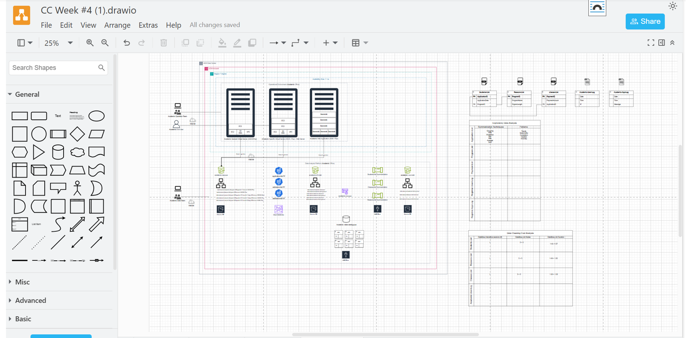
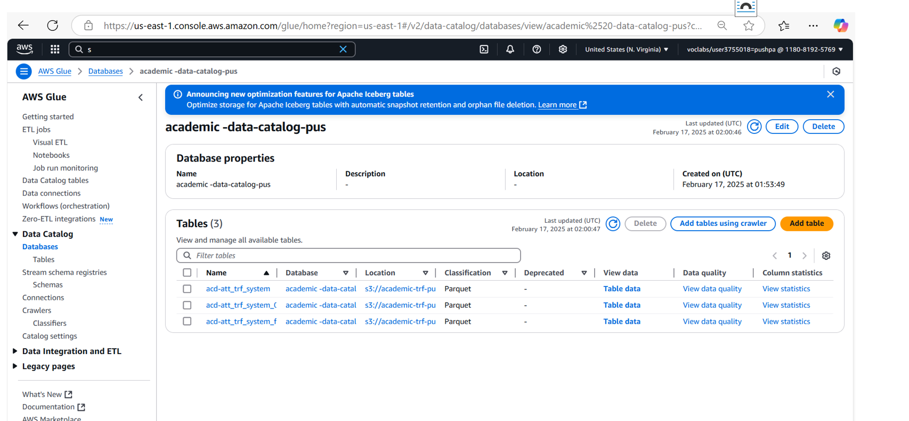

# project
Overview of the three past projects.
# [Project 1: Descriptive Analysis of Sample Student Academic Records]
Objective
The main objective of the project is to conduct a descriptive analysis on simulated data in order to identify potential patterns of student attendance and performance. The data were generated with the aid of ChatGPT, and according to University Canada West (UCW)'s Attendance Policy under the Academic Procedures. The project aims to create an end-to-end data pipeline to prepare, summarize, and store the insights on AWS cloud tools.
Dataset
The dataset was generated by asking ChatGPT to simulate realistic student data that adhered to UCW's attendance rules. The dataset contained:
- Demographic attributes: `age`, `class_id`
- Academic status and logs of participation
- Absence reasons (such as illness, transport problem, or personal reasons)
It was structured and stored in Amazon S3 and processed through AWS Glue.

Methodology
1. Data Preparation
- Synthetic CSV/Parquet data were uploaded to Amazon S3.
- Folder structures were created based on academic year, month, and attendance events.
- The data were cataloged into tables using AWS Glue Crawlers.

2. ETL Process with AWS Glue
- Development of different visual ETL jobs using AWS Glue Studio, including:
  - Students-list-Summarization
  - Classes-list-Summarization
  - Reasons-list-Summarization

- Cleaning, schema matching, and aggregate transformations to group students by age, class, and reason for absence were done.

3. Outputs and Storage
- The final output was stored in Parquet format in S3.
- Summary tables were created grouped by:
  - Average age
  - Number of absences per reason
  - Class-level participation metrics

Tools and Technologies
- AWS Glue Studio : ETL design
- Amazon S3: data storage
- Glue Data Catalog: schema metadata
- Parquet: efficient data format
- Draw.io: for the pipeline design diagram
- ChatGPT: to generate realistic synthetic data
Deliverables
- Three summarized datasets grouped by age, class, and reason
- Glue ETL workflows performing transformation and aggregation
- Draw.io architecture diagram showing full data flow
- Output files stored in S3 and viewable via Glue Catalog
Architecture Overview

Screenshots

# [Project 1: Descriptive Analysis of Sample Student Academic Records]
Control of Data Quality
To achieve reliability and integrity of attendance records processed, quality check mechanism was included in the Glue ETL pipeline. This pipeline separates clean records with faulty ones and outputs them to separate folders in Amazon S3.
The Glue job had included conditional concatenation and branching configuration to allow sending:
- Passed records to the `Passed/` folder
- Failed/missing fields to the `Failed/` folder
Visual ETL Job for Quality Check

Output Files in Amazon S3
Passed/ records

❌ Failed/ records

